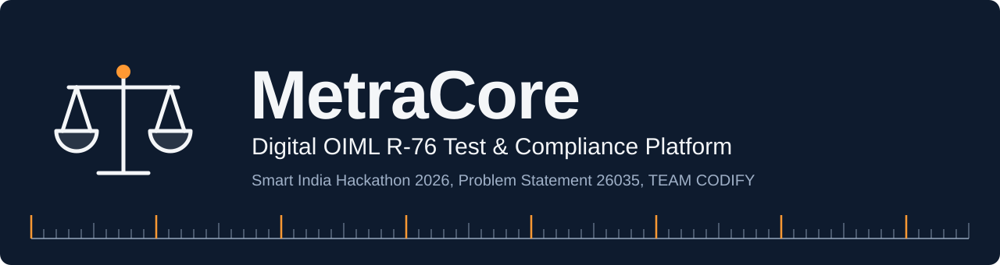
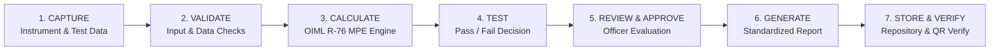
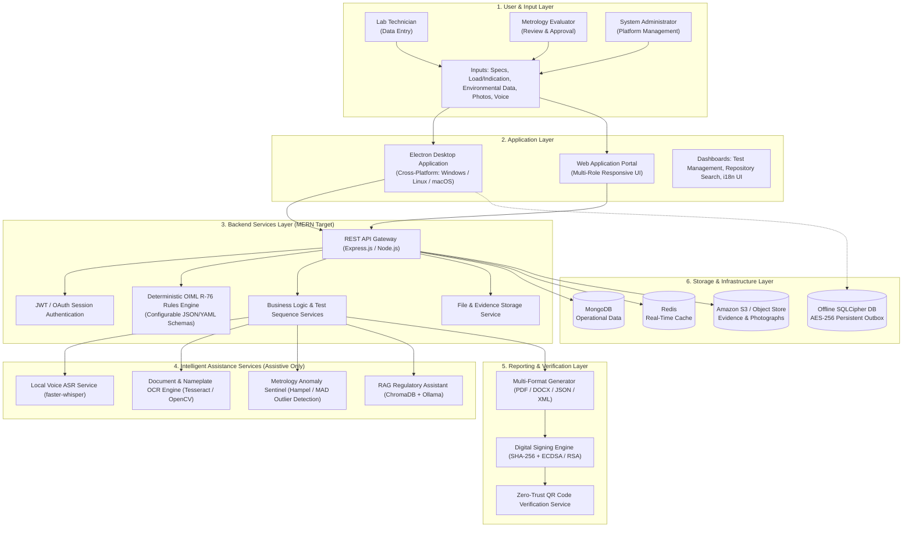
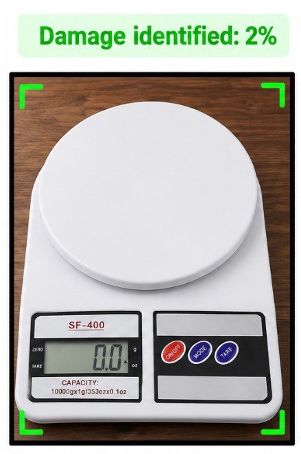
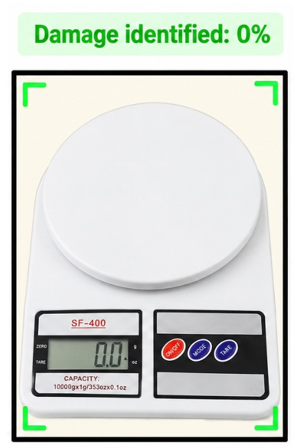
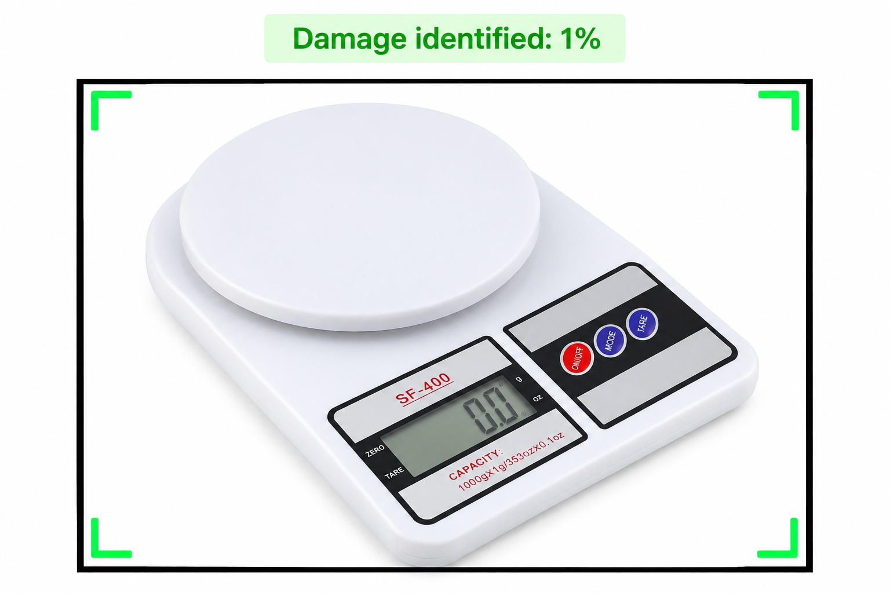

<a id="top"></a>

<div align="center">




<b><a href="#live-links">Live Links</a> &nbsp;|&nbsp; <a href="#sec-3">Overview</a> &nbsp;|&nbsp; <a href="#sec-7">Features</a> &nbsp;|&nbsp; <a href="#sec-8">Innovation</a> &nbsp;|&nbsp; <a href="#sec-9">Architecture</a> &nbsp;|&nbsp; <a href="#sec-12">Status</a> &nbsp;|&nbsp; <a href="#sec-14">Demo</a> &nbsp;|&nbsp; <a href="#sec-15">Setup</a> &nbsp;|&nbsp; <a href="#sec-21">Team</a></b>

<table align="center">
<tr>
<td align="center"><h3>6</h3>Core Modules</td>
<td align="center"><h3>9</h3>Innovations</td>
<td align="center"><h3>7</h3>Workflow Stages</td>
<td align="center"><h3>3</h3>User Roles</td>
<td align="center"><h3>3</h3>Languages<br/><sub>English, हिंदी, मराठी</sub></td>
</tr>
</table>

</div>

# ⚖️ MetraCore: Digital OIML R-76 Test & Compliance Platform

> **A standardized, rule-governed digital platform for automated test data recording, deterministic error validation, and tamper-verifiable test report generation for Non-Automatic Weighing Instruments (NAWI) under OIML Recommendation R-76 and the Legal Metrology framework.**

---

<a id="live-links"></a>

## 🔗 Live Demo & Downloads

<div align="center">

[](https://youtu.be/1f3soIosi1g?si=29GzDRuu-cFNQcIk)
[](https://nawi-oiml.onrender.com)
[](https://drive.google.com/drive/folders/1bL-Z4PTV_OUlAXmeXlXKa7FIosJ886iz?usp=share_link)

</div>

---

### 📋 Quick Evaluation Summary (SIH Evaluator Snapshot)

| Parameter | Details |
| :--- | :--- |
| 📛 **Project Name** | **MetraCore** (Digital OIML R-76 Test & Compliance Platform) |
| 🏆 **Hackathon** | **Smart India Hackathon 2026** |
| 🔢 **Problem Statement ID** | **26035** |
| 📝 **Problem Statement Title** | Development of a Software Program/Application for Generation of Test Reports for Non-Automatic Weighing Instruments (NAWI) as per OIML Recommendation R-76 |
| 🏛️ **Nodal Authority** | Ministry of Consumer Affairs, Food & Public Distribution — Department of Consumer Affairs (DoCA) |
| 🗂️ **Theme / Category** | Miscellaneous / Software |
| 👥 **Team Identity** | **TEAM CODIFY** (Team ID: `158210`) |
| ⭐ **Primary Differentiator** | Decoupled, version-controlled OIML compliance rules engine paired with an explainable compliance trace and local hands-free metrology data entry |
| 💻 **Prototype Availability** | Runnable **Web Application** (Multi-Role Portal) & **Desktop Application** (Electron wrapper with local ASR backend service) |
| 🛠️ **Current Repository Status** | Fully operational three-role UI prototype, deterministic client-side MPE calculations, faster-whisper voice extraction microservice, and Electron runtime package |

<details open>
<summary><b>📑 Table of Contents</b></summary>

<br/>

| Group | Jump to |
| :-- | :-- |
| **🧭 Overview** | [🔗 Live Demo & Downloads](#live-links) · [1. Project Title](#sec-1) · [2. SIH Problem Statement](#sec-2) · [3. Executive Overview](#sec-3) · [4. Problem We Address](#sec-4) · [5. Proposed Solution](#sec-5) |
| **⚙️ Solution & Design** | [6. How the System Works](#sec-6) · [7. Key Features](#sec-7) · [8. Innovation & Differentiators](#sec-8) · [9. System Architecture](#sec-9) · [10. Technology Stack](#sec-10) |
| **🚀 Prototype & Run** | [11. Repository Structure](#sec-11) · [12. Implementation Status](#sec-12) · [13. Screenshots / UI Preview](#sec-13) · [14. Demo](#sec-14) · [15. Installation & Setup](#sec-15) · [16. Configuration](#sec-16) · [17. Testing & Validation](#sec-17) |
| **🛡️ Trust & Roadmap** | [18. Security & Privacy](#sec-18) · [19. Limitations](#sec-19) · [20. Future Scope](#sec-20) |
| **👥 Team & References** | [21. Team Information](#sec-21) · [22. References](#sec-22) · [23. Prototype Disclaimer](#sec-23) |

</details>

---

## <a id="sec-1"></a>🎯 1. Project Title & One-Line Value Proposition

**MetraCore: Digital OIML R-76 Test & Compliance Platform**  
*Transitioning legal metrology laboratory evaluations from fragmented, manual spreadsheets to an automated, deterministic, and cryptographically verifiable digital reporting ecosystem.*

MetraCore is engineered specifically for legal metrology testing laboratories and verification authorities evaluating Non-Automatic Weighing Instruments (electronic scales, platform scales, and weighbridges). The platform digitizes the entire testing lifecycle—from initial instrument parameterization and raw test observation recording to piecewise Maximum Permissible Error (MPE) evaluation, automated standardized report compilation (aligned with OIML R 76-2), and searchable historical archiving.

<p align="right"><sub><a href="#top">⬆ Back to top</a></sub></p>

---

## <a id="sec-2"></a>🏛️ 2. SIH Problem Statement Information

* **Problem Statement ID:** `26035`
* **Problem Statement Title:** Development of a Software Program/Application for Generation of Test Reports for Non-Automatic Weighing Instruments (NAWI) as per OIML Recommendation R- 76
* **Organisation:** Ministry of Consumer Affairs, Food & Public Distribution
* **Department:** Department of Consumer Affairs (DoCA)
* **Category:** Software
* **Theme:** Miscellaneous
* **Statutory & Regulatory Baseline:** Legal Metrology Act, 2009; Legal Metrology (General) Rules, 2011; and OIML Recommendation R 76 (*Non-automatic weighing instruments*, Parts 1 & 2).

### 🔍 Problem Context
Under the Legal Metrology Act, 2009 and the Legal Metrology (General) Rules, 2011, NAWIs used across commerce, industry, agriculture, and healthcare must obtain model approval and undergo stringent metrological verification before being deployed. Designated laboratories evaluate instruments against OIML Recommendation R-76, compiling performance data across weighing performance, repeatability, eccentricity, tare, discrimination, and temperature influence. In practice, these evaluations rely heavily on manual data entry into spreadsheets or static document templates. This operational reality creates severe data transcription bottlenecks, introduces calculation error risks, produces non-uniform report formats across different regional laboratories, complicates auditability, and makes updating calculation logic difficult when international recommendations are revised.

<p align="right"><sub><a href="#top">⬆ Back to top</a></sub></p>

---

## <a id="sec-3"></a>🔭 3. Executive Overview

MetraCore establishes a unified, structured software environment to conduct, verify, and archive NAWI type evaluations. Designed around three explicit laboratory user personas—**Lab Technicians**, **Metrology Evaluators (Review Officers)**, and **System Administrators**—the platform replaces ad-hoc spreadsheets with guided digital workflows.

```
+----------------------------------------------------------------------------------------------------+
|                                      METRACORE WORKFLOW RUNTIME                                    |
|                                                                                                    |
|  [Lab Technician]             [Deterministic Engine]            [Metrology Evaluator]   [Output]   |
|  * Parameter Entry   --->     * Piecewise MPE Check    --->     * Anomaly Review   ---> * PDF/DOCX |
|  * Voice/Manual Obs           * Tolerance Pass/Fail             * Final Approval        * JSON/XML |
+----------------------------------------------------------------------------------------------------+
```

1. **Structured Data Acquisition:** Captures instrument specifications (accuracy class I–IIII, $Max$, $Min$, $e$, $d$) and environmental conditions (temperature, humidity, atmospheric pressure).
2. **Deterministic Evaluation:** Implements the piecewise Maximum Permissible Error (MPE) algorithm to assess raw load and indication observations strictly against OIML R-76 formulas, completely eliminating rounding and manual formula errors.
3. **Assisted Review & Accountability:** Provides review officers with an **Explainable Compliance Trace** and **Metrology Anomaly Sentinel** to highlight observation inconsistencies prior to formal sign-off.
4. **Standardized Deliverables:** Exports legally compliant, standardized digital reports in printable PDF, editable DOCX, and machine-actionable JSON formats, indexed for immediate retrieval.

<p align="right"><sub><a href="#top">⬆ Back to top</a></sub></p>

---

## <a id="sec-4"></a>🚧 4. Problem We Address

| Operational Challenge | Industry & Laboratory Reality | MetraCore Solution |
| :--- | :--- | :--- |
| ✍️ **Manual Data Transcription** | Technicians manually copy test observations from physical scales to paper logbooks or spreadsheets, introducing transcription mistakes. | **Structured Observation Matrix & Hands-Free Entry:** Guided input tables with real-time range bounds and local speech-to-field extraction. |
| 🧮 **Calculation Inaccuracy** | Complex piecewise formulas for scale intervals ($0 \le m \le 500e$, $500e < m \le 2000e$, etc.) lead to manual formula mistakes. | **Algorithmic MPE Engine:** Deterministic calculation of error of indication and permissible tolerances based on instrument accuracy class. |
| 📄 **Disparate Report Formats** | Laboratories generate custom spreadsheet layouts, making inter-agency verification and national standardization difficult. | **OIML R 76-2 Report Generation:** Automatic population of standardized test report formats matching international models. |
| 🔎 **Fragmented Auditability** | Physical test sheets and localized files hinder retrospective auditing and verification of model approval compliance. | **Centralized Immutable Repository:** Role-controlled repository maintaining complete evaluation records, audit trails, and attached photographs. |
| 🔄 **Regulatory Revision Risk** | When OIML recommendations or national metrology rules are updated, hardcoded software platforms require expensive developer rewrites. | **Dynamic Compliance Rules Engine:** Parameterized rule definitions (JSON/YAML) enabling zero-downtime updates as standards evolve. |

<p align="right"><sub><a href="#top">⬆ Back to top</a></sub></p>

---

## <a id="sec-5"></a>💡 5. Proposed Solution

MetraCore delivers six core functional modules aligned with the requirements of the Department of Consumer Affairs (DoCA):

```
+-------------------------------------------------------------------------------------------------------+
|                                    CORE SOLUTION CAPABILITIES (DoCA)                                  |
+-----------------------------------+-----------------------------------+-------------------------------+
| 01. Dynamic Instrument Profiling  | 02. OIML R-76 Observation Matrix  | 03. Algorithmic MPE Engine    |
| Class I-IIII, Max/Min, e, d       | Real-time validation, environmental| Piecewise error verification, |
| Automated load step mapping       | data & multi-test entry forms     | deterministic pass/fail trace |
+-----------------------------------+-----------------------------------+-------------------------------+
| 04. Automated Report Generator    | 05. Role-Based Access Control     | 06. Machine-Actionable Data   |
| Standardized PDF & DOCX export    | Technician, Evaluator, Admin tiers| Structured JSON/XML outputs   |
| Searchable approval repository    | Granular workflow governance      | for external API integration  |
+-----------------------------------+-----------------------------------+-------------------------------+
```

1. **Dynamic Instrument Profiling & Parameterization:** Captures manufacturer data, model identity, verification scale interval ($e$), actual scale interval ($d$), and accuracy class (I, II, III, IIII). Automatically calculates the number of scale intervals ($n = Max / e$) and defines applicable test load steps.
2. **OIML R-76 Metrological Test Observation Matrix:** Digital data entry forms for all standard evaluation routines (Weighing Performance, Repeatability, Eccentricity, Discrimination, Tare, and Temperature Effect), recording environmental conditions alongside observations.
3. **Algorithmic MPE & Compliance Determination Engine:** Computes absolute error of indication ($E = I - L$) and applies piecewise tolerances ($\pm 0.5e$, $\pm 1.0e$, $\pm 1.5e$) to render an unequivocal Pass/Fail verdict.
4. **Automated Report Generator & Repository:** Compiles verified data into standardized OIML R 76-2 templates in PDF and editable DOCX formats, indexing records in a searchable repository.
5. **Role-Based Access Control (RBAC) Dashboard:** Distinct workflows enforcing separation of duties between testing technicians, reviewing metrology officers, and platform administrators.
6. **Machine-Actionable Digital Test Reports:** Produces structured JSON/XML payloads alongside visual reports, enabling interoperability with national trade databases and laboratory information management systems (LIMS).

<p align="right"><sub><a href="#top">⬆ Back to top</a></sub></p>

---

## <a id="sec-6"></a>⚙️ 6. How the System Works

The platform follows a rigorous seven-stage digital workflow:



### 🛡️ Architectural Guardrail: Deterministic Rules vs. AI Assistance
> [!IMPORTANT]
> **MetraCore maintains strict separation between compliance calculation and assistive intelligence:**
> * **Deterministic Rules Engine (Authoritative):** All regulatory MPE calculations, tolerance thresholds, and Pass/Fail compliance decisions are executed via pure deterministic mathematical algorithms.
> * **Intelligent Assistance (Non-Authoritative):** AI/ML features (Voice data extraction, Anomaly Sentinel, OCR nameplate cross-checking, and RAG knowledge search) operate strictly as human-in-the-loop decision-support tools. AI models cannot alter or override the deterministic compliance outcome.

### 🔄 End-to-End Workflow Stages:
1. **Instrument Capture & Profiling:** The technician enters manufacturer and technical parameters. The platform dynamically validates that $n = Max / e$ conforms to the declared accuracy class boundaries.
2. **Observation Capture:** Environmental parameters (temperature, humidity, atmospheric pressure) are verified against laboratory tolerance ranges ($20^\circ\text{C}$–$26^\circ\text{C}$, $30\%$–$70\%$ RH). Raw load ($L$) and indicated value ($I$) observations are entered manually or via hands-free speech input.
3. **Deterministic Calculation:** The engine computes the error ($E = I - L$) and compares it against the load-dependent MPE tier for the specified accuracy class.
4. **Compliance Determination:** Each measurement step receives an automated Pass or Fail mark.
5. **Evaluator Review:** The Metrology Evaluator inspects the review queue, examines uploaded photographic evidence, evaluates any anomaly flags, and reviews the transparent calculation trace before issuing formal approval.
6. **Standardized Report Generation:** The system populates the OIML R 76-2 layout, generating print-ready PDF and editable DOCX files.
7. **Archiving & Verification:** The record is indexed in the digital repository, and a cryptographic verification QR code is generated for field authenticity checks.

<p align="right"><sub><a href="#top">⬆ Back to top</a></sub></p>

---

## <a id="sec-7"></a>✨ 7. Key Features

### 📐 Core Testing & Metrological Compliance
* **Piecewise MPE Evaluation:** Deterministic computation of permissible limits for Class I, II, III, and IIII instruments across all load ranges.
* **Multi-Test Matrix Execution:** Structured modules covering Weighing Performance, Eccentricity (corner loading), Repeatability, Zero Setting, Tare, and Temperature Influence.
* **Environmental Boundary Monitoring:** Real-time checking of ambient laboratory temperature, relative humidity, and pressure with out-of-tolerance warning alerts.

### 🗂️ Reporting, Verification & Repository
* **Multi-Format Export:** Client-side generation of standardized OIML R 76-2 reports in PDF (via `html2pdf.js`), DOCX (via `html-docx`), and machine-actionable JSON data formats.
* **Evidence Management:** Upload and fullscreen inspection of instrument nameplates, overall unit photos, and corner test setups.
* **Comprehensive Audit Trail:** Time-stamped event logging capturing test submissions, evaluator revisions, and administrative configuration updates.

### 🔑 User & Workflow Governance (RBAC)
* **Lab Technician Portal:** Guided new test wizard, live calculation feedback, and instrument repository overview.
* **Metrology Evaluator Workspace:** Dedicated review queue, side-by-side OCR comparison tab, visual compliance status badges, and approval/rejection workflows.
* **System Administrator Console:** Centralized oversight of active rule packages, authorized laboratories, platform user accounts, and system health status.

### 🤖 Intelligent Decision Support (Assistive)
* **Hands-Free Metrology Entry:** Voice-driven observation entry allowing technicians to record weights and indications hands-free while handling test standards.
* **Metrology Anomaly Sentinel:** Algorithmic screening to detect irregular error shifts across test series (e.g., non-linear corner drift in eccentricity tests).
* **Explainable Compliance Trace:** Step-by-step mathematical reasoning exposing $Input \rightarrow Calculation \rightarrow MPE \rightarrow Decision$.
* **Multilingual Interface:** Integrated language toggle supporting English, Hindi (हिंदी), and Marathi (मराठी) to minimize cognitive burden for laboratory personnel.

<p align="right"><sub><a href="#top">⬆ Back to top</a></sub></p>

---

## <a id="sec-8"></a>🚀 8. Innovation & Differentiators

MetraCore introduces nine distinct technical innovations specifically engineered for the legal metrology environment:

```
+----------------------------------------------------------------------------------------------------+
|                                    METRACORE INNOVATION MATRIX                                     |
+-----------------------------------+-----------------------------------+----------------------------+
| Dynamic OIML Compliance Rules     | Hands-Free Metrology Entry        | AI Nameplate Validation    |
| Versioned JSON/YAML rule schemas  | Local speech-to-field extraction  | OCR cross-check of manual  |
| eliminating hardcoded logic       | via faster-whisper ASR            | specs against photos       |
+-----------------------------------+-----------------------------------+----------------------------+
| Zero-Trust Cryptographic QR       | Contextual Multilingual UI        | Offline-First Lab Mode     |
| SHA-256 hash + ECDSA signature    | English, Hindi, Marathi UI with   | Local encrypted storage    |
| for tamper-evident field checks   | standardized English reporting    | with background sync       |
+-----------------------------------+-----------------------------------+----------------------------+
| Metrology Anomaly Sentinel        | Explainable Compliance Trace      | RAG Knowledge Assistant    |
| Hampel/MAD outlier screening for  | Complete mathematical derivation  | Source-grounded regulatory |
| physical test irregularities      | path for audit transparency       | guidance on OIML R-76      |
+-----------------------------------+-----------------------------------+----------------------------+
```

1. **Dynamic OIML Compliance Rules Engine (DOCRE):**  
   *Metrology Value:* Rather than hardcoding regulatory thresholds into code, test criteria and MPE limits are defined in version-controlled JSON/YAML rule packages. When international OIML recommendations are revised, administrators deploy updated rule schemas with zero system downtime and complete historical version preservation.
2. **Hands-Free Metrology Data Entry:**  
   *Metrology Value:* Technicians physically handling heavy standard test weights (e.g., 20 kg cast iron standards) can record test values verbally without contaminating or handling keyboards, significantly accelerating high-volume test sequences.
3. **AI-Assisted Nameplate & Document Validation:**  
   *Metrology Value:* Employs Optical Character Recognition (OCR) to extract $Class$, $Max$, $Min$, $e$, and $d$ directly from uploaded nameplate photos, automatically flagging discrepancies against manual technician inputs before testing begins.
4. **Cryptographic Report Verification via Zero-Trust QR:**  
   *Metrology Value:* Generates a SHA-256 payload hash signed with system private keys (ECDSA/RSA) encoded into an embedded QR code, enabling market surveillance officers to instantly verify report authenticity against the central repository.
5. **Contextual Multilingual UI:**  
   *Metrology Value:* Allows grassroots laboratory personnel across India to navigate procedures and input data in regional languages (Hindi, Marathi, English) while generating the final formal compliance certificate in standardized legal terminology.
6. **Offline-First Laboratory Mode:**  
   *Metrology Value:* Enables field testing of remote industrial weighbridges in zero-connectivity environments through an encrypted local database (SQLCipher) and an event-sourced persistent outbox queue that synchronizes automatically when network access resumes.
7. **Metrology Anomaly Sentinel (Hampel / MAD Screening):**  
   *Metrology Value:* Screens observation series using Median Absolute Deviation (MAD) to detect subtle mechanical binding, corner tilt, or thermal drift that individual piecewise limits might miss, alerting testing officers before an inaccurate certificate is granted.
8. **Explainable Compliance Trace:**  
   *Metrology Value:* Eliminates opaque "black-box" verdicts by displaying the complete calculation chain ($Raw \rightarrow Adjusted \rightarrow Tolerance \rightarrow Result$), providing clear legal auditability for contested approvals.
9. **RAG Regulatory Knowledge Assistant:**  
   *Metrology Value:* Provides instant, source-grounded technical guidance on complex OIML test clauses and setup requirements directly within the technician interface.

<p align="right"><sub><a href="#top">⬆ Back to top</a></sub></p>

---

## <a id="sec-9"></a>🏗️ 9. System Architecture

The target architecture is a high-availability, modular enterprise metrology solution designed around a **MERN-oriented backend service foundation** and cross-platform desktop/web delivery.



### 🧱 Target Architectural Layers:
1. **User & Input Layer:** Ingestion of instrument parameters, environmental metrics, observation series, photographs, and audio recordings.
2. **Application Layer:** Cross-platform Electron desktop client for field/offline deployments and a web application portal for administrative and centralized lab operations.
3. **Backend Services Layer:** RESTful API services built on Node.js/Express.js orchestrating authentication, business logic, file management, and dynamic rule package parsing.
4. **Intelligent Assistance Services (Auxiliary):** Isolated microservices executing local speech recognition (faster-whisper), OCR discrepancy extraction, anomaly pattern screening, and vector-backed knowledge assistance (ChromaDB + Ollama).
5. **Reporting & Verification Layer:** Document rendering pipeline compiling OIML R 76-2 layouts and generating cryptographically signed verification QR codes.
6. **Data & Storage Layer:** MongoDB for primary operational data, Redis for real-time caching, Amazon S3 (or compatible object storage) for image/document evidence, and SQLCipher with AES-256 encryption for offline field storage.

<p align="right"><sub><a href="#top">⬆ Back to top</a></sub></p>

---

## <a id="sec-10"></a>🧰 10. Technology Stack

*This section details the target production architecture defined in the SIH solution documentation, alongside the technologies demonstrated in the current prototype.*

> **Status legend:** ✅ Implemented &nbsp;|&nbsp; 🟡 Demonstrated / Mocked / Static &nbsp;|&nbsp; 🔵 Target / Planned

```
+----------------------------------------------------------------------------------------------------+
|                                      METRACORE TECHNOLOGY STACK                                    |
+-----------------------------------+-----------------------------------+----------------------------+
| APPLICATION & UI                  | BACKEND SERVICES                  | DATABASE & STORAGE         |
| Target: React.js + Electron       | Target: Node.js + Express.js      | Target: MongoDB + Redis    |
| Prototype: Vanilla JS, CSS3, HTML5| Prototype: Python FastAPI Microsvc| Prototype: Client State, JSON|
+-----------------------------------+-----------------------------------+----------------------------+
| AI, SPEECH & VISION               | KNOWLEDGE & RAG                   | SECURITY & CRYPTO          |
| faster-whisper (local ASR),       | Target: ChromaDB + Ollama         | SHA-256, ECDSA, RSA,       |
| Tesseract OCR, OpenCV             | Prototype: Indexed lexical search | SQLCipher (AES-256), JWT   |
+-----------------------------------+-----------------------------------+----------------------------+
```

| Architectural Category | Target / Proposed Production Stack | Current Prototype Implementation | Status |
| :--- | :--- | :--- | :--- |
| **User Interface / Web** | React.js, Tailwind CSS / Vanilla CSS, HTML5 | HTML5, Vanilla CSS, Vanilla JavaScript, Chart.js, FontAwesome | ✅ **Implemented (UI Prototype)** |
| **Desktop Application** | Electron framework (Cross-platform) | Electron (`v44.5.1`), `electron-builder`, `preload.js` | ✅ **Implemented & Verifiable** |
| **Backend & API Layer** | Node.js, Express.js (MERN architecture), REST API | Python FastAPI (`v0.100+`) voice extraction microservice | 🟡 **Demonstrated (Voice Service)** |
| **Operational Database** | MongoDB (Document Store), Redis (Cache) | Browser LocalStorage / In-memory JavaScript data models | 🔵 **Target Architecture** |
| **Offline Storage** | SQLCipher (256-bit AES encryption) + Outbox Queue | Local filesystem / Electron runtime local context | 🔵 **Target Architecture** |
| **Object & File Storage** | Amazon S3 / Scalable Object Storage | Local repository static asset directories (`Website/Frontend/img`) | 🟡 **Prototype Mocked** |
| **Speech Recognition (ASR)** | `faster-whisper` (Local ASR, `int8` quantization) | `faster-whisper` (`v1.2.1`), `ffmpeg-python`, `soundfile` | ✅ **Implemented & Verifiable** |
| **Document OCR** | Tesseract OCR, OpenCV, Vision microservice | UI comparison workflow, static image inspection cards | 🟡 **Demonstrated / UI Flow** |
| **Anomaly Screening** | Hampel Filter using Median Absolute Deviation (MAD) | Evaluator workspace anomaly warning card & explanation flow | 🟡 **Demonstrated / UI Flow** |
| **Knowledge Base & RAG** | ChromaDB vector store + Ollama (Qwen2.5-7B) | In-browser lexical search assistant (`qa-assistant.js`, `Docs/qa.json`) | 🟡 **Demonstrated (In-Browser)** |
| **Reporting Engine** | Predefined OIML R 76-2 PDF & DOCX templates | Client-side `html2pdf.js` and `html-docx` export engines | ✅ **Implemented & Verifiable** |
| **Cryptographic Security** | SHA-256 hash chaining, ECDSA/RSA digital signing | Client-side embedded QR representation (`qr.png`) | 🟡 **Demonstrated / UI Flow** |
| **Internationalization** | `i18next` client library + Bhashini API integration | Comprehensive `i18n.js` translation map (English, Hindi, Marathi) | ✅ **Implemented & Verifiable** |

<p align="right"><sub><a href="#top">⬆ Back to top</a></sub></p>

---

## <a id="sec-11"></a>📂 11. Repository Structure

The repository represents the working main-branch codebase containing the web application, Electron desktop packaging, and voice processing service:

```
TEAM_CODIFY_SIH26035-main/
│
├── Electron -  Desktop App/             # Desktop Application distribution package
│   ├── main.js                         # Electron main process (window configuration & lifecycle)
│   ├── preload.js                      # Secure context bridge script
│   ├── package.json                    # Node dependencies & electron-builder configuration
│   ├── Homepage.html                   # Desktop application role landing page
│   ├── test.js                         # Automated Puppeteer end-to-end UI verification script
│   ├── start_backend.sh                # Shell script to initialize local voice service
│   ├── start_frontend.sh               # Shell script to launch local web server on port 5500
│   ├── NAWI_user/                      # Desktop bundle: Lab Technician portal
│   ├── NAWI_Evaluator/                 # Desktop bundle: Metrology Evaluator portal
│   ├── NAWI_ Administrator/            # Desktop bundle: System Administrator portal
│   └── voice_service/                  # Local embedded voice extraction service
│       ├── app/                        # FastAPI service application modules
│       ├── tests/                      # Pytest suite for voice & extraction logic
│       ├── manual_test.py              # Synthetic audio generation & API verification script
│       └── requirements.txt            # Python dependencies for speech processing
│
├── Website/                             # Core Web Application & Microservices
│   ├── Frontend/                       # Multi-Role Web Application Frontend
│   │   ├── index.html                  # Unified role selection portal
│   │   ├── css/                        # Global and homepage styling sheets
│   │   ├── js/                         # Central homepage routing scripts
│   │   ├── img/                        # Test evidence photographs (Nameplate, Side, Front)
│   │   ├── NAWI_user/                  # Lab Assistant / Applicant Portal
│   │   │   ├── index.html              # Technician overview dashboard
│   │   │   ├── pages/
│   │   │   │   ├── new-test.html       # Instrument parameterization & test preparation wizard
│   │   │   │   ├── test-evaluation.html# Step-by-step OIML R-76 test evaluation execution
│   │   │   │   ├── Report.html         # Standardized test report view & export screen
│   │   │   │   ├── my-tests.html       # Laboratory assigned test schedule
│   │   │   │   └── instrment-repo.html # Instrument catalog and history
│   │   │   ├── js/
│   │   │   │   ├── new-test.js         # Real-time n=Max/e calculations & test determination
│   │   │   │   ├── test-evaluation.js  # Live observation error & MPE evaluation engine
│   │   │   │   ├── voice-entry.js      # Microphone recording & API field population logic
│   │   │   │   ├── i18n.js             # Client translation engine (English, Hindi, Marathi)
│   │   │   │   ├── Report.js           # html2pdf & html-docx document export handlers
│   │   │   │   └── qa-assistant.js     # Lexical OIML R-76 Q&A assistant logic
│   │   │   └── Docs/                   # Embedded regulatory Q&A dataset (qa.json)
│   │   ├── Metrology Evaluator/        # Testing Officer / Reviewer Portal
│   │   │   ├── pages/
│   │   │   │   ├── dashboard.html      # Evaluator metric summary & workload overview
│   │   │   │   ├── review-workspace.html# Deep review suite (Observations, MPE, Anomaly, Trace)
│   │   │   │   ├── review-queue.html   # Pending application evaluation queue
│   │   │   │   └── audit-trail.html    # Traceable decision log and system events
│   │   │   └── js/                     # Review workspace tab controllers & modal handlers
│   │   └── NAWI_ Administrator/        # System Administrator Portal
│   │       └── NAWI_Administrator/
│   │           ├── index.html          # Administrative operations dashboard
│   │           └── pages/
│   │               ├── rule-packages.html # OIML rule package management & schema upload
│   │               ├── user-management.html# Role and access permissions administration
│   │               ├── lab-management.html# Designated laboratory facility controls
│   │               └── ai-services.html   # Intelligence service oversight & guardrails
│   │
│   └── Backend/                        # Python FastAPI Voice Entry Microservice
│       ├── Dockerfile                  # Container definition with ffmpeg & Python 3.10
│       ├── render.yaml                 # Cloud deployment manifest for voice service
│       ├── requirements.txt            # Backend dependencies (fastapi, faster-whisper, etc.)
│       ├── app/
│       │   ├── main.py                 # FastAPI application, CORS, and transcription endpoints
│       │   ├── schemas.py              # Pydantic schemas for voice field extraction
│       │   ├── asr/                    # Faster-whisper model loader and transcriber
│       │   └── extraction/             # NLP token normalizers and regex entity extractors
│       └── tests/                      # Automated test suite (test_api.py, test_extraction.py)
│
└── README.md                           # Authoritative platform documentation
```

<p align="right"><sub><a href="#top">⬆ Back to top</a></sub></p>

---

## <a id="sec-12"></a>📊 12. Prototype Implementation Status

*The following matrix provides an honest, evidence-backed accounting of the current repository contents versus the proposed target architecture:*

> **Status legend:** ✅ Implemented &nbsp;|&nbsp; 🟡 Demonstrated / Mocked / Static &nbsp;|&nbsp; 🔵 Target / Planned

| Feature / Module | Architecture Tier | Current Status | Repository Evidence / Location | Verification Notes |
| :--- | :--- | :--- | :--- | :--- |
| **Role-Based Portals** | Application | ✅ **Implemented & Verifiable** | `Website/Frontend/` (`index.html`, `NAWI_user`, `Metrology Evaluator`, `NAWI_ Administrator`) | Operational UI for all three roles: Technician, Evaluator, and System Admin. |
| **Instrument Profiling** | Core Metrology | ✅ **Implemented & Verifiable** | `Website/Frontend/NAWI_user/js/new-test.js` | Computes $n = Max / e$, verifies scale interval boundaries, and maps test scopes. |
| **MPE & Compliance Engine** | Core Metrology | ✅ **Implemented & Verifiable** | `Website/Frontend/NAWI_user/js/test-evaluation.js` | Evaluates load indications against MPE tolerances; outputs live Pass/Fail badges. |
| **Standardized Reports** | Output | ✅ **Implemented & Verifiable** | `Website/Frontend/NAWI_user/js/Report.js` | Generates PDF and DOCX downloads via `html2pdf.js` and `html-docx`. |
| **Voice Data Entry** | Intelligent Assist | ✅ **Implemented & Verifiable** | `Website/Backend/` and `Website/Frontend/NAWI_user/js/voice-entry.js` | FastAPI microservice using `faster-whisper` and regex normalizers to populate form fields. |
| **Desktop Application** | Runtime | ✅ **Implemented & Verifiable** | `Electron -  Desktop App/` (`package.json`, `main.js`, `test.js`) | Electron application running on macOS, Linux, and Windows with local window framing. |
| **Automated End-to-End Tests** | Quality & Testing | ✅ **Implemented & Verifiable** | `Website/Backend/tests/` and `Electron -  Desktop App/test.js` | Pytest suite for voice endpoints and Puppeteer script for Electron window verification. |
| **Multilingual UI (i18n)** | Usability | ✅ **Implemented & Verifiable** | `Website/Frontend/NAWI_user/js/i18n.js` | Comprehensive client translation dictionary supporting English, Hindi, and Marathi. |
| **Regulatory Q&A Assistant** | Decision Support | 🟡 **Demonstrated (In-Browser)**| `Website/Frontend/NAWI_user/js/qa-assistant.js` and `Docs/qa.json` | In-browser lexical search answering common OIML R-76 questions from pre-extracted data. |
| **Explainable Compliance Trace**| Decision Support | 🟡 **Demonstrated (UI Flow)** | `Website/Frontend/Metrology Evaluator/pages/review-workspace.html` | Visual calculation flow decomposing input data, calculation steps, and MPE limits. |
| **Anomaly Sentinel** | Decision Support | 🟡 **Demonstrated (UI Flow)** | `Website/Frontend/Metrology Evaluator/pages/review-workspace.html` | Evaluator UI flagging corner load error vectors with human-in-the-loop review actions. |
| **OCR Nameplate Check** | Decision Support | 🟡 **Demonstrated (UI Flow)** | `Website/Frontend/Metrology Evaluator/pages/review-workspace.html` | Side-by-side mismatch comparison table cross-checking manual entries with sample photo specs. |
| **Evidence Management** | Compliance | 🟡 **Demonstrated / Static** | `Website/Frontend/img/` | Static photographic assets (`Name-plate.jpeg`, `Front-view.jpeg`, etc.) loaded into cards. |
| **Dynamic Rules Management** | Architecture | 🟡 **Demonstrated (UI Flow)** | `Website/Frontend/NAWI_ Administrator/NAWI_Administrator/pages/rule-packages.html` | Administrator interface to view active packages and upload new schema definitions. |
| **MERN Backend API** | Target Architecture | 🔵 **Target / Planned** | Solution documentation & PPT Slide 3 | Planned production application stack (Node.js, Express.js, MongoDB, Redis). |
| **Offline SQLCipher DB** | Security / Storage | 🔵 **Target / Planned** | Solution documentation & PPT Slide 4 | Planned 256-bit AES encrypted local SQLite database with background event sync. |
| **RAG Assistant (Ollama)** | Intelligent Assist | 🔵 **Target / Planned** | Solution documentation & PPT Slide 3 | Planned server-side vector pipeline combining ChromaDB and local Ollama models. |
| **Cryptographic QR Signing**| Security | 🟡 **Demonstrated / Mocked**| `Website/Frontend/NAWI_user/img/qr.png` | Visual QR code placeholder embedded in report view; ECDSA backend signing planned. |

<p align="right"><sub><a href="#top">⬆ Back to top</a></sub></p>

---

## <a id="sec-13"></a>🖼️ 13. Screenshots / UI Preview

*All previews represent verified views and assets present in the repository:*

### 📷 1. Instrument Photographic Evidence Assets
The repository contains sample physical test assets utilized in the review workspace for nameplate and setup validation:

| Nameplate Specification Plate | Overall Front Instrument View | Overall Side Instrument View |
| :---: | :---: | :---: |
|  |  |  |
| *Verified nameplate displaying capacity, class, and interval parameters.* | *Front profile of unit under test used for structural verification.* | *Side profile verifying leveling, pan stability, and cable clearance.* |

### 🖥️ 2. Operational Workspaces & Dashboards (Demonstrated in Codebase)
* **Metrology Evaluator Review Workspace (`review-workspace.html`):** Features tabbed navigation across Instrument & Nameplate (with OCR mismatch tables), Test Observations (eccentricity corner results), Compliance & MPE (deterministic verdict), Anomaly Sentinel, Evidence Checklist, and Explainable Compliance Trace.
* **Technician Test Evaluation Engine (`test-evaluation.html`):** Live observation table calculating absolute error ($E = I - L$) and rendering dynamic Pass/Fail badges against MPE tolerances.
* **Administrator Governance Console (`rule-packages.html` & `index.html`):** Central dashboard tracking active OIML rule packages, connected laboratories, user access tiers, and system health status.
* **Tamper-Evident Report QR Asset:** Sample verification QR code (`Website/Frontend/NAWI_user/img/qr.png`) integrated into the standardized test report view (`Report.html`).

<p align="right"><sub><a href="#top">⬆ Back to top</a></sub></p>

---

## <a id="sec-14"></a>🎬 14. Demo

### 🌐 Current Prototype Access Mode
The current repository contains an active, runnable **local prototype** consisting of the multi-role web platform and the standalone Electron desktop application. Public cloud endpoints and recorded demonstration links described in hackathon presentation slides are hosted locally via the procedures below.

* **Primary Access Point:** Run locally via standard web server (`http://localhost:5500`) or Electron desktop application.
* **Scope of Demonstration:**  
  1. Role navigation across Lab Technician, Testing Officer (Evaluator), and System Administrator.
  2. Input of instrument parameters and real-time computation of scale intervals ($n = Max / e$).
  3. Hands-free voice recording via the FastAPI microservice to extract load values into form fields.
  4. Instant MPE pass/fail tolerance evaluation across weighing performance and eccentricity tests.
  5. Evaluator workspace inspection of photographic evidence, OCR mismatch alerts, and compliance traces.
  6. Client-side compilation and download of standardized PDF and DOCX test reports.

<p align="right"><sub><a href="#top">⬆ Back to top</a></sub></p>

---

## <a id="sec-15"></a>📥 15. Installation & Setup

### 📌 Prerequisites
* **Node.js:** `v18.x` or `v20.x` LTS
* **Python:** `3.10+` (required for voice service)
* **System Utilities:** `ffmpeg` (required by `faster-whisper` for audio decoding)
  * *macOS:* `brew install ffmpeg`
  * *Ubuntu/Debian:* `sudo apt update && sudo apt install -y ffmpeg`
  * *Windows:* Install via `winget install Gyan.FFmpeg` or add to system `PATH`.

---

### 🌐 A. Web Application Setup

#### 🔹 Step 1: Start the Voice Entry Backend Microservice
```bash
# Navigate to the backend directory
cd Website/Backend

# Create and activate a Python virtual environment
python3 -m venv venv
source venv/bin/activate    # On Windows: venv\Scripts\activate

# Install Python dependencies
pip install -r requirements.txt

# Run the FastAPI service on port 8005
# (Optional: set ASR_ENGINE=mock for rapid testing without downloading the Whisper model)
uvicorn app.main:app --host 127.0.0.1 --port 8005
```
*The voice service will be accessible at `http://127.0.0.1:8005`. Verify via `http://127.0.0.1:8005/api/voice/health`.*

#### 🔹 Step 2: Launch the Web Application Frontend
In a separate terminal window:
```bash
# Navigate to the frontend directory
cd Website/Frontend

# Start a lightweight local HTTP server
python3 -m http.server 5500
```
Open your browser and navigate to:  
`http://localhost:5500` (or `http://localhost:5500/index.html`)

---

### 🖥️ B. Desktop Application Setup (Electron)

#### 🔹 Step 1: Install Desktop Dependencies
```bash
# Navigate to the Electron desktop application directory
cd "Electron -  Desktop App"

# Install Node dependencies
npm install
```

#### 🔹 Step 2: Start the Embedded Voice Microservice (Optional)
```bash
# From within "Electron -  Desktop App"
./start_backend.sh
# Alternatively, run the Website/Backend service on port 8005 as detailed above.
```

#### 🔹 Step 3: Launch the Desktop Application
```bash
# Start the Electron application
npm start
```

#### 🔹 Step 4: Package Desktop Binaries (Optional)
```bash
# Build platform-specific unpacked binaries into the /release directory
npm run pack

# Package distribution zips
npm run dist:mac    # For macOS
npm run dist:win    # For Windows
npm run dist:linux  # For Linux
```

---

### 📱 C. Mobile Application Notice
*As established in Section 12, the mobile application component represents a planned target architecture platform. Mobile setup instructions are not included as mobile source code is not present in the current repository.*

<p align="right"><sub><a href="#top">⬆ Back to top</a></sub></p>

---

## <a id="sec-16"></a>🔧 16. Configuration

### 🎛️ Environment Variables (Voice Backend Microservice)
The voice microservice (`Website/Backend`) supports configuration via environment variables or a local `.env` file:

```ini
# ASR Engine Selection: 'faster_whisper' (default) or 'mock' (for lightweight testing)
ASR_ENGINE=faster_whisper

# Whisper Model Size: tiny.en, base.en, small.en (default: small.en)
WHISPER_MODEL=small.en

# Compute Device: 'cpu' or 'cuda' (default: cpu)
WHISPER_DEVICE=cpu

# Quantization / Compute Type: 'int8' or 'float32'
WHISPER_COMPUTE_TYPE=int8

# Maximum Permissible Audio Upload Size in Megabytes
MAX_AUDIO_SIZE_MB=10

# Service Port Configuration
PORT=8005
```

> [!NOTE]
> The current prototype does not require cloud API keys, external database connection strings, or third-party paid service tokens for baseline evaluation. To run speech recognition in offline/local mock mode, start the backend with `ASR_ENGINE=mock`.

<p align="right"><sub><a href="#top">⬆ Back to top</a></sub></p>

---

## <a id="sec-17"></a>🧪 17. Testing & Validation

The repository includes automated unit tests, end-to-end integration tests, and manual verification scripts:

```
+----------------------------------------------------------------------------------------------------+
|                                    TESTING & VERIFICATION SUITE                                    |
+-----------------------------------+-----------------------------------+----------------------------+
| 1. Voice Service Unit Tests       | 2. Electron Integration Test      | 3. Synthetic Audio Test    |
| Pytest suite validating API       | Puppeteer script connecting to    | Subprocess script verifying|
| endpoints & NLP extraction        | Electron remote debugging port    | audio generation & parsing |
+-----------------------------------+-----------------------------------+----------------------------+
```

### 🧪 1. Backend & NLP Unit Tests (Pytest)
Validates the FastAPI voice microservice endpoints, schema compliance, payload boundaries, and string/number extraction normalizers:
```bash
cd Website/Backend
source venv/bin/activate
pytest tests/ -v
```
*Test Coverage Summary:*
* `tests/test_api.py`: Validates `/api/voice/health`, `/api/voice/schema`, audio MIME-type enforcement, oversized payload rejection (HTTP 413), and mock transcription output.
* `tests/test_extraction.py`: Validates speech normalizers (`normalize_number`, `normalize_email`, `normalize_id`) and section field extraction for applicant metadata and test load entries.

### 🖱️ 2. Desktop Application End-to-End Test (Puppeteer)
Validates that the Electron desktop runtime launches cleanly, loads the homepage, navigates to the Metrology Evaluator dashboard, and renders UI components:
```bash
cd "Electron -  Desktop App"

# Ensure the Electron app is launched with debugging enabled:
# (npm start executes: electron . --remote-debugging-port=9222)
npm start &

# In a separate terminal, execute the test script:
node test.js
```

### 🎙️ 3. Synthetic Audio & API Integration Verification
Executes a simulated end-to-end audio test using synthetic text-to-speech to verify transcription and field mapping:
```bash
cd "Electron -  Desktop App/voice_service"
python manual_test.py
```

### 🧮 4. Deterministic MPE Calculation Verification
Deterministic calculation logic in `Website/Frontend/NAWI_user/js/test-evaluation.js` can be verified manually across standard load vectors:
* **Ratio Validation:** $Max = 500\,\text{kg}, e = 100\,\text{g} \implies n = 5000$ (Class III).
* **Observation Validation:** Applied Load $L = 150.00\,\text{kg}$, Indication $I = 150.15\,\text{kg} \implies Error\,(E) = +0.15\,\text{kg}$.
* **Tolerance Check:** For Class III at $150\,\text{kg}$ ($1500e$), $\text{MPE} = \pm 1.0e = \pm 0.10\,\text{kg}$. Since $|+0.15| > 0.10$, the engine renders an immediate `FAIL` badge.

<p align="right"><sub><a href="#top">⬆ Back to top</a></sub></p>

---

## <a id="sec-18"></a>🔐 18. Security & Privacy

### ✅ Currently Implemented Controls (Prototype)
* **Client-Side Role Segmentation:** Strict workflow routing across distinct directories for Lab Technicians, Evaluators, and System Administrators.
* **Safe Input Normalization:** Strict MIME-type checking (`audio/*`, `video/webm`) and payload size limits (`MAX_AUDIO_SIZE_MB`) on voice endpoints to prevent resource exhaustion.
* **Isolated Audio Processing:** Recorded voice buffers are written to temporary system storage with automatic cleanup routines (`tempfile.NamedTemporaryFile`).
* **Cross-Origin Resource Sharing (CORS):** Explicit middleware configuration permitting communication between authorized local frontend hosts and backend services.

### 🎯 Target Security Architecture (Production Specification)
* **Role-Based Access Control (RBAC):** Cryptographically signed JWT tokens with short expiration lifetimes and HttpOnly secure cookies.
* **Local Data Protection:** 256-bit AES database encryption using SQLCipher for offline desktop and field deployments.
* **Report Tamper-Evidence:** SHA-256 hash chaining over final report observations combined with asymmetric digital signatures (ECDSA / RSA) for verifiable non-repudiation.
* **Audit Trail Immutability:** Append-only activity logging capturing every test creation, modification, evaluator review, and administrative action.

<p align="right"><sub><a href="#top">⬆ Back to top</a></sub></p>

---

## <a id="sec-19"></a>⚠️ 19. Limitations

To ensure complete technical transparency during hackathon evaluation, the following constraints of the current prototype are documented:

1. **State Persistence:** The current web prototype relies on client-side state, browser LocalStorage, and in-memory JavaScript objects. It does not yet persist records to a central production database (MongoDB).
2. **Deterministic Rules Engine Scope:** The client-side prototype demonstrates MPE calculations for Class III instruments and standard load tests. Full multi-class parameterization (Class I, II, IIII) and automated JSON rule schema uploading are represented as UI workflows awaiting backend API integration.
3. **Voice ASR Hardware Requirements:** Running `faster-whisper` locally requires a multi-core CPU or compatible GPU. On resource-constrained hardware, inference latency may increase. The gated `ai4bharat/indic-conformer-600m-multilingual` model is currently replaced with `faster-whisper` for standard English operation.
4. **Offline Synchronization Queue:** The Electron desktop wrapper provides local execution of the frontend and voice services, but the event-sourced persistent outbox queue for automated cloud synchronization remains in the target architecture phase.
5. **OCR Document Intelligence:** The review workspace demonstrates side-by-side mismatch detection tables and photographic evidence inspection, but automatic server-side OCR image parsing via Tesseract/OpenCV microservices is not yet linked end-to-end.

<p align="right"><sub><a href="#top">⬆ Back to top</a></sub></p>

---

## <a id="sec-20"></a>🔮 20. Future Scope

* **Production MERN Backend Integration:** Deploy the central Node.js/Express.js REST API layer with MongoDB database persistence and Redis caching.
* **Dynamic Rule Package Deployment:** Finalize the backend parser allowing metrology administrators to deploy versioned JSON/YAML OIML rule schemas dynamically.
* **Complete Offline Synchronization Engine:** Implement the SQLite/SQLCipher persistent outbox ledger with event-sourced background synchronization and conflict resolution.
* **Full OCR & Document Intelligence Pipeline:** Deploy containerized Tesseract and OpenCV vision services for automated text extraction from instrument nameplates and calibration certificates.
* **Bhashini API Integration:** Integrate the official Government of India Bhashini API to expand real-time regional language translation and voice input across all scheduled national languages.
* **Hardware Interfacing:** Develop serial/RS-232 and USB data capture drivers to stream load cell indications directly from physical instruments into the observation matrix without manual entry.

<p align="right"><sub><a href="#top">⬆ Back to top</a></sub></p>

---

## <a id="sec-21"></a>👥 21. Team Information

* **Team Name:** TEAM CODIFY  
* **Team ID:** `158210`  
* **Hackathon:** Smart India Hackathon 2026  
* **Problem Statement:** PS-26035 (DoCA)

| Team Identification | Role |
| :--- | :--- |
| *Arya Pritam Nangude* | 💻 Full-Stack development |
| *Atreya Ashish Kshirsagar* | 🌐 Frontend Lead Developer, UI/UX Designer & RAG Developer |
| *Gayatri Mukchand Karkhile* |  💻 Full-Stack development |
| *Jiya Irfan Shahadivan* | 🎨 UI/UX Designer & Presentation |
| *Kapil Chandrashekhar Sorte* |  🖥️ Desktop Application development (Electron) |
| *Sakib Samir Tamboli* |  🤖 AI/ML |

*(Note: In accordance with hackathon documentation standards, individual student participant names and personal contact information are maintained in the official SIH portal submission rather than hardcoded in the public repository).*

<p align="right"><sub><a href="#top">⬆ Back to top</a></sub></p>

---

## <a id="sec-22"></a>📚 22. References

### ⚖️ Statutory & Regulatory Standards
1. **OIML R 76-1 (Edition 2006 / 2023):** *Non-automatic weighing instruments — Part 1: Metrological and technical requirements — Tests.* International Organization of Legal Metrology. [www.oiml.org](https://www.oiml.org)
2. **OIML R 76-2 (Edition 2006 / 2023):** *Non-automatic weighing instruments — Part 2: Test report format.* International Organization of Legal Metrology.
3. **The Legal Metrology Act, 2009 (No. 1 of 2010):** Ministry of Consumer Affairs, Food and Public Distribution, Government of India. [consumeraffairs.nic.in](https://consumeraffairs.nic.in)
4. **The Legal Metrology (General) Rules, 2011:** Department of Consumer Affairs, Government of India.

### 🧰 Core Technologies & Documentation
5. **Faster-Whisper:** Fast speech recognition library using CTranslate2. [github.com/SYSTRAN/faster-whisper](https://github.com/SYSTRAN/faster-whisper)
6. **Electron Documentation:** Build cross-platform desktop apps with JavaScript, HTML, and CSS. [www.electronjs.org](https://www.electronjs.org)
7. **FastAPI Framework:** Modern, high-performance web framework for building APIs with Python. [fastapi.tiangolo.com](https://fastapi.tiangolo.com)
8. **SQLCipher:** Full Database Encryption for SQLite. [github.com/sqlcipher/sqlcipher](https://github.com/sqlcipher/sqlcipher)
9. **OpenSSL ECDSA:** Elliptic Curve Digital Signature Algorithm Documentation. [www.openssl.org](https://www.openssl.org)

<p align="right"><sub><a href="#top">⬆ Back to top</a></sub></p>

---

## <a id="sec-23"></a>📜 23. Prototype Disclaimer

> [!CAUTION]
> **Smart India Hackathon 2026 Prototype Notice:**  
> This repository contains a working engineering prototype developed by **TEAM CODIFY** for **Smart India Hackathon 2026 Problem Statement 26035**.  
> * Certain architectural layers, background synchronization mechanisms, cryptographic certificate authorities, and AI-assisted modules are partially implemented, demonstrated via simulated interfaces, or planned as target production architecture.
> * This software is intended solely for evaluation, demonstration, and technical assessment purposes. It does not constitute formal regulatory certification, statutory model approval, legal verification stamping, or official endorsement by the Department of Consumer Affairs (DoCA) or the Government of India.

---

<div align="center">

**Built by TEAM CODIFY for Smart India Hackathon 2026, Problem Statement 26035** 🇮🇳

<sub><a href="#top">⬆ Back to top</a></sub>

</div>
